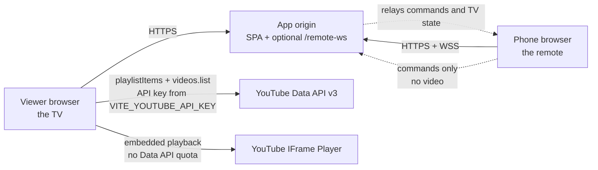
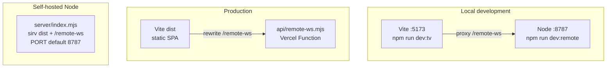
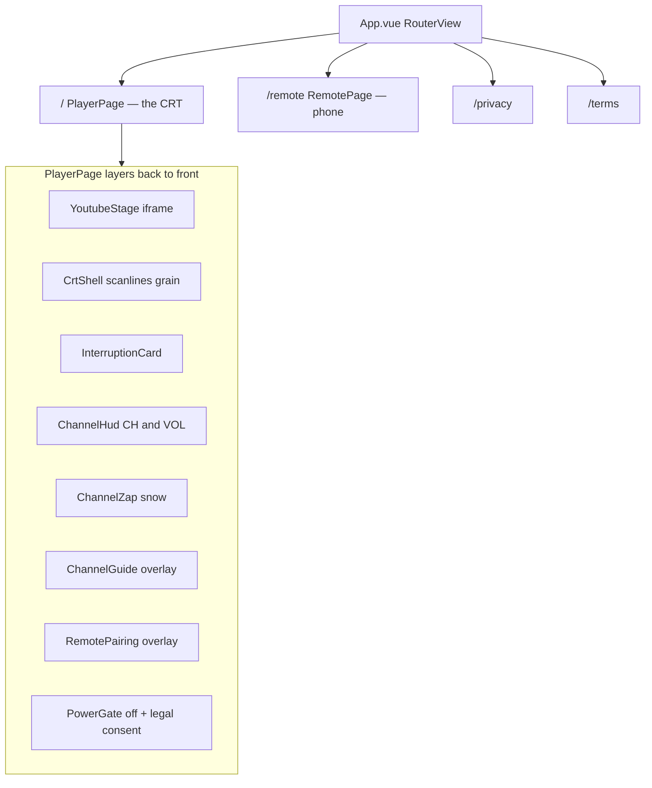
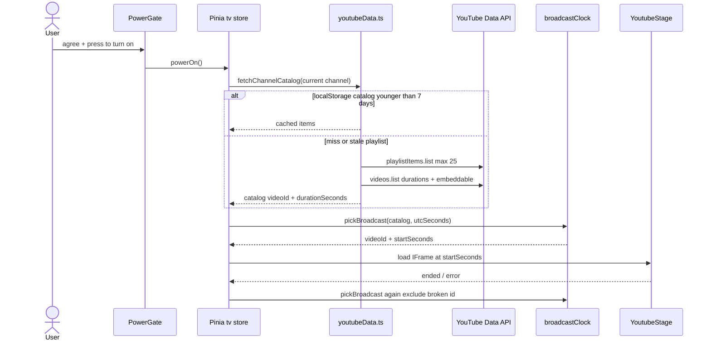
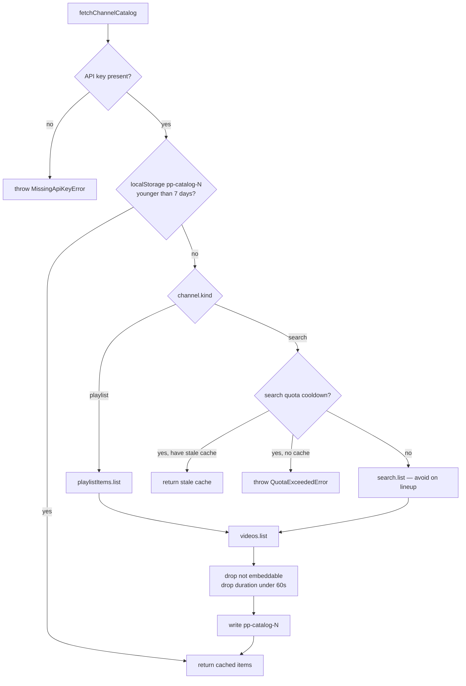
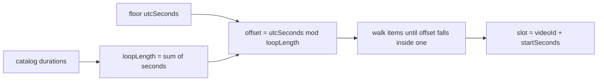
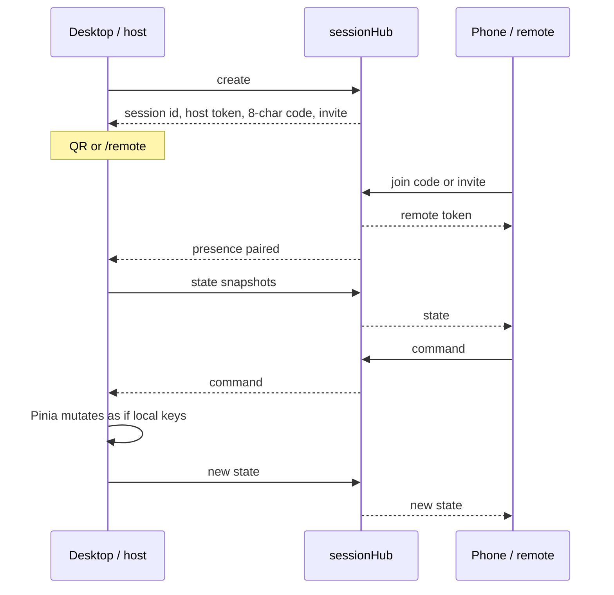
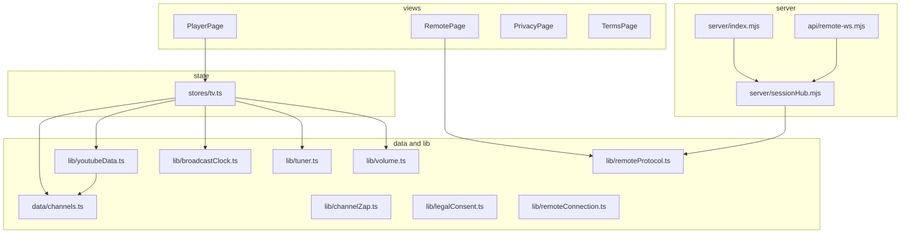

# Positive Player architecture

Living source of truth for agents. Dated specs under `docs/superpowers/` are historical. If they conflict with this file, this file wins.

**Product:** a CRT-style always-on television in the browser. Viewers turn the set on, flip channels, and land mid-stream on whatever is “on air.” A phone can pair as a remote. Picture and sound stay on the TV. Video is never downloaded, rehosted, or proxied.

**Stack:** Vue 3 + Vite + Pinia + Vue Router SPA. YouTube Data API v3 for catalogs. YouTube IFrame Player API for playback. Optional Node WebSocket relay for the phone remote.

---

## 1. System context

Video bytes never pass through this origin. The remote never talks to YouTube.

---

## 2. Deployment

Two ways to run. Same SPA. Remote WebSocket is the only server process.

| Environment | Command | Remote |
| --- | --- | --- |
| Dev | `npm run dev` | Vite proxies `/remote-ws` to `127.0.0.1:8787` |
| Vercel | Git deploy | `vercel.json` rewrites `/remote-ws` to `api/remote-ws.mjs`; SPA fallback to `index.html` |
| Self-host | `npm run build` then `npm start` | Same Node process serves `dist` and WebSocket |

Vercel Function `includeFiles` must keep `server/**`, `src/lib/remoteProtocol.ts`, and `src/data/channels.ts` (the hub validates channel numbers against `CHANNEL_COUNT`).

Env:

| Name | Where | Purpose |
| --- | --- | --- |
| `VITE_YOUTUBE_API_KEY` | Build / `.env.local` | Browser Data API key. Restrict by HTTP referrer. Never commit. |
| `PUBLIC_ORIGIN` | Node server | Exact public origin for WebSocket origin checks |
| `TRUST_PROXY` | Node server | `1` only behind a trusted proxy that sets `X-Forwarded-For` |
| `PORT` | Node server | Overrides `8787` |

---

## 3. Routes and UI layers

Power-on requires the station notice: Privacy Policy, Terms of Service, and YouTube ToS. Consent is `pp-legal-consent` = `CONSENT_VERSION` (`2026-09-08` today). Bump `CONSENT_VERSION` in `src/lib/legalConsent.ts` when those documents change in a way that needs a new agreement.

YouTube Data API and the IFrame Player must not run until the viewer has agreed and powered on.

---

## 4. Runtime data flow on the TV

`src/stores/tv.ts` is the only place that owns power, channel, volume, interruption, and the current slot. Components render; they do not fetch YouTube.

---

## 5. Channels and catalogs

Lineup: `src/data/channels.ts`. Contiguous numbers `1..CHANNEL_COUNT` (125). Channels 121–125 are DD Era (DD Classics, Ramayan, Mahabharat, Jungle Book, Shaktimaan). Do not renumber existing channels.

**Current lineup kind is `playlist`.** Each row has a YouTube uploads playlist id (`UU…`, derived from a channel id `UC…`). Individual video ids are not hardcoded. The station is fixed; the latest ~25 uploads are fetched at runtime.

`kind: 'search'` still exists in `fetchChannelCatalog` for compatibility. **Do not put search channels back on the lineup.** Default YouTube projects allow **100 `search.list` calls per day** (quota metric “Search Queries”). 125 search channels exhaust that in one flip-through. `playlistItems.list` and `videos.list` cost 1 unit each from the general 10,000-unit pool and do not use the Search Queries bucket.

Quota cooldown (`pp-youtube-quota-until`, 12 hours) applies to **search only**. A Search 429 must not block playlist fetches. The TV store does not retry `QuotaExceededError` every 8 seconds; other catalog failures retry.

Catalog cache key is `pp-catalog-${channel.number}`. Cache is per browser, not shared across viewers.

To retarget a station, change `playlistId` in `src/data/channels.ts`. Regenerating ids from YouTube handles: `node scripts/resolve-playlists.mjs` (needs `.env.local` and a referrer-allowed key). Keep playlist ids unique across the lineup.

---

## 6. Broadcast clock

Same channel + same UTC second => same `{ videoId, startSeconds }` for every viewer with the same catalog. That is the “always-on TV” contract. Do not randomize per session.

On `ended`, run the clock again at `now`. On player error: show the interruption card for 2 seconds, skip that `videoId` for the rest of the tab session, run the clock on what remains. Hold the card if the catalog is empty.

---

## 7. Remote control

Video stays on the desktop. The phone is a second screen for power, channel, volume, mute.

Protocol: `src/lib/remoteProtocol.ts` (shared with the Node hub via type stripping). Commands: `channelStep`, `volumeStep`, `digit`, `mute`, `powerOff`, `powerToggle`. Host is authoritative. Remote cannot write volume/channel except by command.

Pairing rules agents must keep:

- One phone per TV
- Invite/code expire after 5 minutes and are consumed on first use
- Resume credentials live in `sessionStorage` for that tab only (`pp-remote-host` / `pp-remote-remote`)
- Offline button presses are not queued
- Disconnected host has 2 minutes to reconnect; sessions die after 12 hours
- In-memory hub, max 1,000 TVs; multiple replicas cannot share sessions
- `powerToggle` from the remote works in standby only after the desktop has accepted the station notice
- Origin check on WebSocket upgrade; rate limits on pairing and messages

---

## 8. Browser persistence

| Key | Storage | Content |
| --- | --- | --- |
| `pp-legal-consent` | localStorage | Consent version string |
| `pp-channel` | localStorage | Last channel number |
| `pp-volume` | localStorage | `{ volume, muted, lastNonZero }` |
| `pp-catalog-N` | localStorage, sessionStorage fallback | `{ items, fetchedAt }` |
| `pp-youtube-quota-until` | localStorage | Search cooldown timestamp |
| `pp-remote-host` / `pp-remote-remote` | sessionStorage | `{ role, id, token }` |

Missing or blocked storage must not brick the TV for the visit. Unavailable saved channel falls back to channel 1.

---

## 9. Module map

| Path | Responsibility |
| --- | --- |
| `src/stores/tv.ts` | Power, tune, volume, catalogs, interruption, HUD timers |
| `src/data/channels.ts` | Lineup, tags, `playlistId` |
| `src/lib/youtubeData.ts` | Data API, cache, quota, duration parse |
| `src/lib/broadcastClock.ts` | UTC slot picker |
| `src/components/YoutubeStage.vue` | IFrame Player only |
| `src/composables/useTvRemote.ts` | Host side of pairing |
| `server/sessionHub.mjs` | Pairing, relay, rate limits |
| `scripts/resolve-playlists.mjs` | Maintainer: map handles → uploads playlist ids |

---

## 10. Invariants for future changes

1. **Do not call `search.list` for the built-in lineup.** Playlists only. Search remaining in code is a last-resort path, not a product default.
2. **Do not prefetch every channel** on power-on. Fetch the tuned channel only.
3. **Do not proxy, cache, or rehost video files.** IFrame Player only. Data API is metadata (ids, duration, embeddable).
4. **Do not run Data API or IFrame API before legal consent + power-on.**
5. **Keep the broadcast clock deterministic** from UTC and the catalog. Same catalog + same UTC second = same slot.
6. **Do not renumber existing channels.** Append new ones. DD Era stays 121–125.
7. **Do not commit `.env` / `.env.local` or API keys.** Restrict the browser key by HTTP referrer.
8. **Do not send video over the remote WebSocket.** Commands and snapshots only. Payload cap 4 KB.
9. **Interruption copy stays Hindi + English** on the card. No official Doordarshan wordmark.
10. **`prefers-reduced-motion: reduce`:** still scanlines, no grain motion, zap becomes a brief dark frame.
11. **Tests:** `npm run test:unit -- --run`, `npm run test:server`, `npm run build`. Playback tests mock YouTube and must not spend quota.

---

## 11. Historical docs

| File | Status |
| --- | --- |
| `docs/superpowers/specs/2026-09-07-crt-youtube-player-design.md` | Original CRT player spec. Still useful for HUD, zap, clock math. Lineup is **no longer 120 search channels**. |
| `docs/superpowers/plans/2026-09-07-crt-youtube-player.md` | Implementation plan; completed. |
| `docs/superpowers/plans/2026-09-07-mobile-remote.md` | Remote plan; completed. |
| `README.md` | Operator setup, not architecture. |

When the lineup, quota strategy, remote protocol, or consent version changes, update this file in the same PR.
