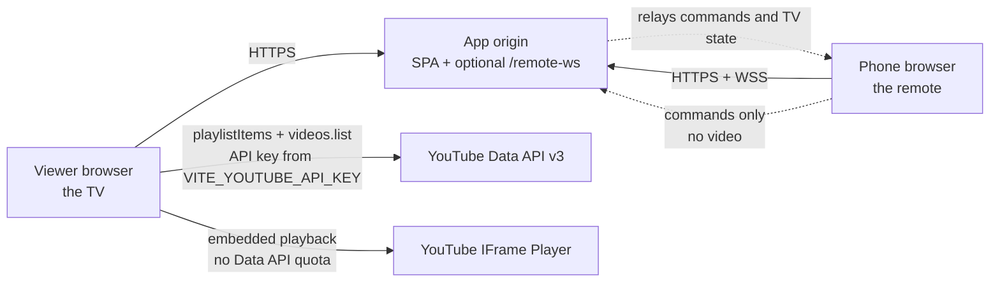
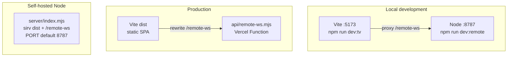
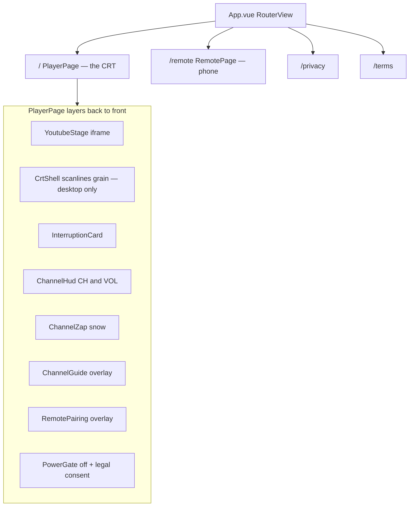
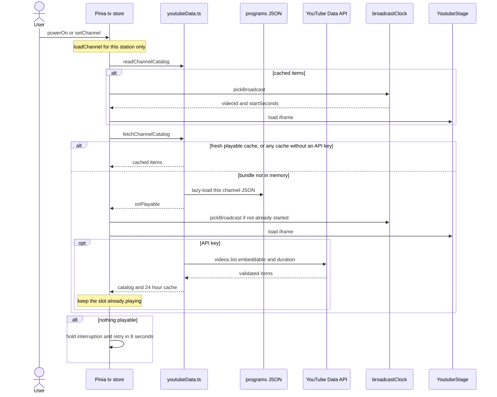
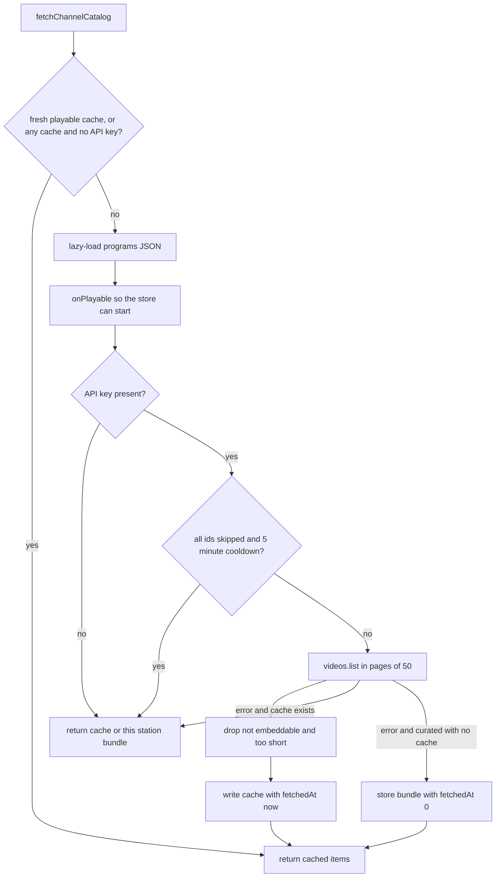
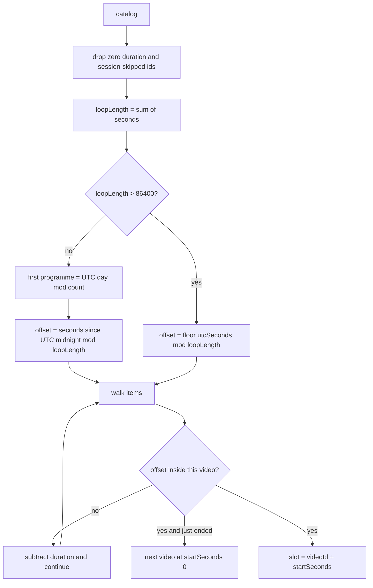
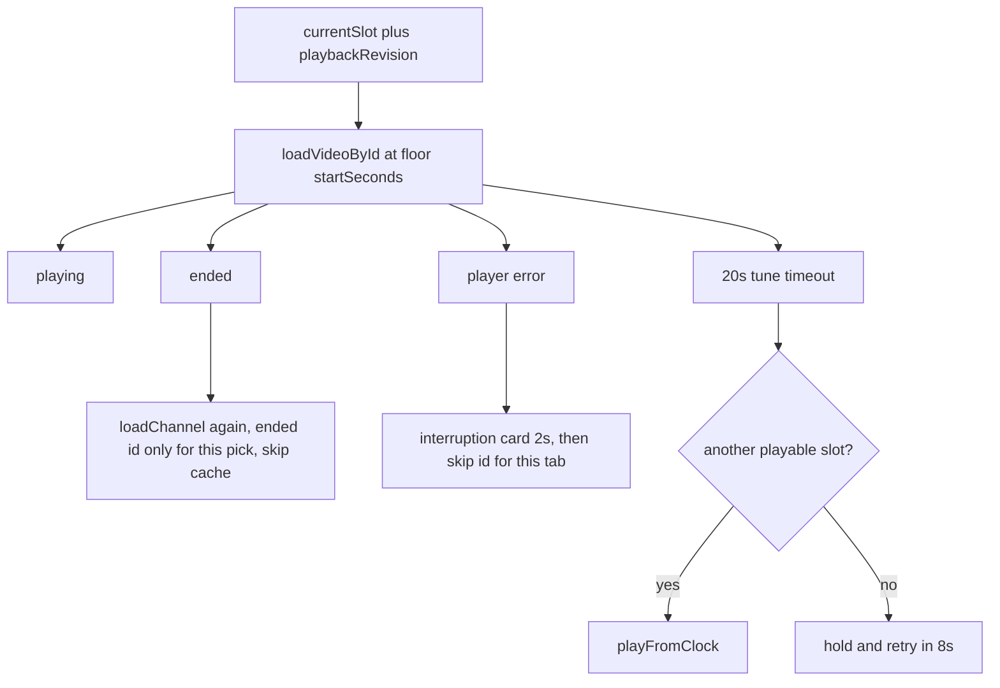
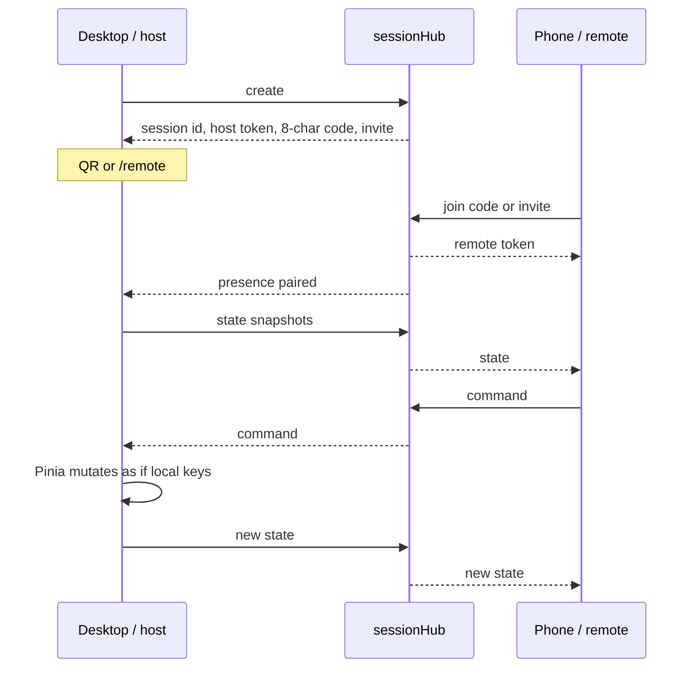
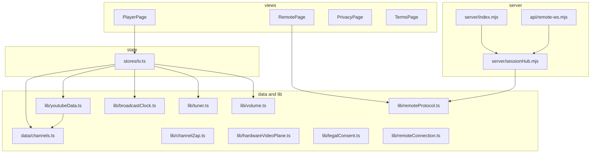
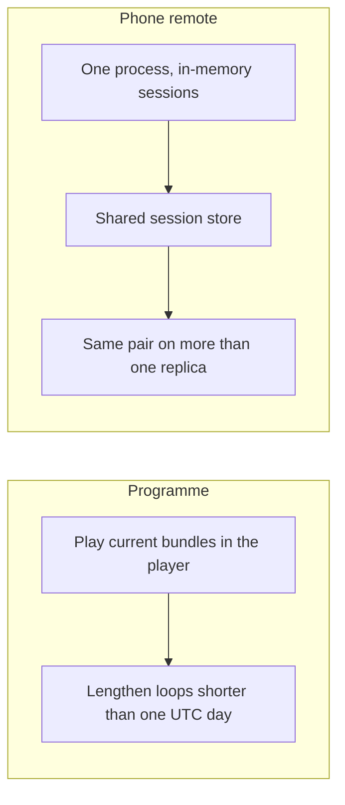

# Positive Player architecture

Living source of truth for agents. Dated specs under `docs/superpowers/` are historical. If they conflict with this file, this file wins.

**Product:** a CRT-style always-on television in the browser. Viewers turn the set on, flip channels, and land mid-stream on whatever is “on air.” A phone can pair as a remote. Picture and sound stay on the TV. Video is never downloaded, rehosted, or proxied.

**Stack:** Vue 3 + Vite + Pinia + Vue Router SPA. YouTube Data API v3 for catalogs. YouTube IFrame Player API for playback. Optional Node WebSocket relay for the phone remote.

---

## 1. System context

```mermaid
flowchart LR
  Viewer[Viewer browser<br/>the TV]
  Phone[Phone browser<br/>the remote]
  Origin[App origin<br/>SPA + optional /remote-ws]
  YTData[YouTube Data API v3]
  YTPlay[YouTube IFrame Player]

  Viewer -->|HTTPS| Origin
  Phone -->|HTTPS + WSS| Origin
  Viewer -->|playlistItems + videos.list<br/>API key from VITE_YOUTUBE_API_KEY| YTData
  Viewer -->|embedded playback<br/>no Data API quota| YTPlay
  Phone -.->|commands only<br/>no video| Origin
  Origin -.->|relays commands and TV state| Phone
```

Video bytes never pass through this origin. The remote never talks to YouTube.

---

## 2. Deployment

Two ways to run. Same SPA. Remote WebSocket is the only server process.

```mermaid
flowchart TB
  subgraph local [Local development]
    Vite[Vite :5173<br/>npm run dev:tv]
    Node[Node :8787<br/>npm run dev:remote]
    Vite -->|"proxy /remote-ws"| Node
  end

  subgraph prod [Production]
    Static[Vite dist<br/>static SPA]
    Fn["api/remote-ws.mjs<br/>Vercel Function"]
    Static -->|rewrite /remote-ws| Fn
  end

  subgraph selfhost [Self-hosted Node]
    Sirv["server/index.mjs<br/>sirv dist + /remote-ws<br/>PORT default 8787"]
  end
```

| Environment | Command | Remote |
| --- | --- | --- |
| Dev | `npm run dev` | Vite proxies `/remote-ws` to `127.0.0.1:8787` |
| Vercel | Git deploy | `vercel.json` rewrites `/remote-ws` to `api/remote-ws.mjs`; SPA fallback to `index.html` |
| Self-host | `npm run build` then `npm start` | Same Node process serves `dist` and WebSocket |

Vercel Function `includeFiles` must keep `server/**`, `src/lib/remoteProtocol.ts`, and `src/data/channels.ts` (the hub validates channel numbers against `CHANNEL_COUNT`).

Env:

| Name | Where | Purpose |
| --- | --- | --- |
| `VITE_YOUTUBE_API_KEY` | Build / `.env.local` | Browser Data API key. Restrict by HTTP referrer. Never commit. |
| `VITE_GTM_ID` | Build / `.env.local` | Google Tag Manager container ID. Public. Empty omits the tag. |
| `PUBLIC_ORIGIN` | Node server | Exact public origin for WebSocket origin checks |
| `TRUST_PROXY` | Node server | `1` only behind a trusted proxy that sets `X-Forwarded-For` |
| `PORT` | Node server | Overrides `8787` |

---

## 3. Routes and UI layers

```mermaid
flowchart TB
  App[App.vue RouterView]
  App --> Player["/ PlayerPage — the CRT"]
  App --> Remote["/remote RemotePage — phone"]
  App --> Privacy["/privacy"]
  App --> Terms["/terms"]

  subgraph crt [PlayerPage layers back to front]
    YT[YoutubeStage iframe]
    Shell[CrtShell scanlines grain — desktop only]
    Card[InterruptionCard]
    HUD[ChannelHud CH and VOL]
    Zap[ChannelZap snow]
    Guide[ChannelGuide overlay]
    Pair[RemotePairing overlay]
    Gate[PowerGate off + legal consent]
  end

  Player --> crt
```

Power-on requires the station notice: Privacy Policy, Terms of Service, and YouTube ToS. Consent is `pp-legal-consent` = `CONSENT_VERSION` (`2026-09-08` today). Bump `CONSENT_VERSION` in `src/lib/legalConsent.ts` when those documents change in a way that needs a new agreement.

YouTube Data API and the IFrame Player must not run until the viewer has agreed and powered on.

---

## 4. Runtime data flow on the TV

Power-on and channel changes call `loadChannel` for the tuned station only.

```mermaid
sequenceDiagram
  actor User
  participant Store as Pinia tv store
  participant Data as youtubeData.ts
  participant Bundle as programs JSON
  participant YT as YouTube Data API
  participant Clock as broadcastClock
  participant Stage as YoutubeStage

  User->>Store: powerOn or setChannel
  Note over Store: loadChannel for this station only
  Store->>Data: readChannelCatalog
  alt cached items
    Store->>Clock: pickBroadcast
    Clock-->>Store: videoId and startSeconds
    Store->>Stage: load iframe
  end
  Store->>Data: fetchChannelCatalog
  alt fresh playable cache, or any cache without an API key
    Data-->>Store: cached items
  else bundle not in memory
    Data->>Bundle: lazy-load this channel JSON
    Data-->>Store: onPlayable
    Store->>Clock: pickBroadcast if not already started
    Store->>Stage: load iframe
    opt API key
      Data->>YT: videos.list embeddable and duration
      YT-->>Data: validated items
      Data-->>Store: catalog and 24 hour cache
      Note over Store: keep the slot already playing
    end
  end
  alt nothing playable
    Store->>Store: hold interruption and retry in 8 seconds
  end
```

`src/stores/tv.ts` is the only place that owns power, channel, volume, interruption, and the current slot. Components render; they do not fetch YouTube.

A cached catalog, including a stale one, can start playback before the network returns. `onPlayable` can start from the station’s bundle before `videos.list` finishes. The first slot wins for that tune; a later validated catalog is stored and used at the next programme boundary. API failure falls back to that same station’s bundle. An empty catalog holds the interruption card and retries in 8 seconds. `QuotaExceededError` does not retry. Another station is never substituted.

---

## 5. Channels and catalogs

Lineup: `src/data/channels.ts`. Contiguous numbers `1..CHANNEL_COUNT`. Do not renumber existing channels; append new ones. DD Era is 003 Jungle Book, 004 Shaktimaan, 005 DD Classics, 006 Ramayan, 007 Mahabharat, and 013 Vintage India.

**Current lineup kind is `curated`.** Each station lazy-loads its own bundled list from `src/data/programs/` through `src/data/curatedPrograms.ts`. The home page, channel guide, and remote do not load those lists. Playback never needs `search.list`.

`kind: 'search'` and `kind: 'playlist'` still exist in `fetchChannelCatalog` for compatibility. **Do not put search channels back on the lineup.** Default YouTube projects allow **100 `search.list` calls per day** (quota metric “Search Queries”). `videos.list` costs 1 unit from the general 10,000-unit pool and does not use the Search Queries bucket.

```mermaid
flowchart TD
  Start[fetchChannelCatalog]
  Start --> Fresh{"fresh playable cache, or any cache and no API key?"}
  Fresh -->|yes| Return[return cached items]
  Fresh -->|no| Bundle["lazy-load programs JSON"]
  Bundle --> Play[onPlayable so the store can start]
  Play --> Key{API key present?}
  Key -->|no| Same[return cache or this station bundle]
  Key -->|yes| Cool{"all ids skipped and 5 minute cooldown?"}
  Cool -->|yes| Same
  Cool -->|no| Vids["videos.list in pages of 50"]
  Vids --> Filter["drop not embeddable and too short"]
  Filter --> Write["write cache with fetchedAt now"]
  Write --> Return
  Vids -->|error and cache exists| Same
  Vids -->|error and curated with no cache| BundleBack["store bundle with fetchedAt 0"]
  BundleBack --> Return
```

Quota cooldown (`pp-youtube-quota-until`, 12 hours) applies to **search only**. A Search 429 must not block curated validation. The TV store does not retry `QuotaExceededError` every 8 seconds; other catalog failures retry.

Catalog cache keys include channel number, kind, and source: `pp-catalog-${channel.number}-${channel.kind}-${encodeURIComponent(source)}`, plus topic terms when the station has them. For a curated station, `source` is `curatedVersion`. Cache is per browser, not shared across viewers. Nonempty stale catalogs remain usable while a refresh fails. An empty validation is remembered only for the 5-minute exhausted cooldown, not as a fresh 24-hour catalog.

Curated items shorter than 1 second are dropped; other kinds still drop anything under 60 seconds. Title terms, when set, drop videos whose titles do not match. HTTP 404 yields an empty catalog. If every remaining id has failed playback, one refresh is allowed, then the same items are reused until the 5-minute cooldown ends. There is no backup station: an empty or failed catalog holds the interruption card on the requested channel.

To change what a station plays, edit `src/data/handPickedPrograms.ts` or regenerate with `npm run bundle:programs`. Hand-picked selections take precedence over generated lists. A changed bundle version changes the cache key.

---

## 6. Broadcast clock

Same channel + same UTC second => same `{ videoId, startSeconds }` for every viewer with the same catalog. That is the “always-on TV” contract. Do not randomize per session.

```mermaid
flowchart TD
  Catalog[catalog] --> Drop["drop zero duration and session-skipped ids"]
  Drop --> Sum["loopLength = sum of seconds"]
  Sum --> Long{"loopLength > 86400?"}
  Long -->|no| Rotate["first programme = UTC day mod count"]
  Rotate --> DayWalk["offset = seconds since UTC midnight mod loopLength"]
  Long -->|yes| Cont["offset = floor utcSeconds mod loopLength"]
  DayWalk --> Walk[walk items]
  Cont --> Walk
  Walk --> Hit{offset inside this video?}
  Hit -->|no| Advance[subtract duration and continue]
  Advance --> Walk
  Hit -->|yes and just ended| Next["next video at startSeconds 0"]
  Hit -->|yes| Slot["slot = videoId + startSeconds"]
```

A short loop rotates its starting programme each UTC day and walks only that day’s elapsed seconds, so the same daily timetable does not repeat forever. A loop longer than 24 hours walks continuously from the Unix epoch, so midnight does not jump backward through a multi-day catalogue. An ended video keeps its duration in that walk. Skipping it selects the next video at `startSeconds` 0. If it is the only usable video, it is replayed at the clock offset.

```mermaid
flowchart TD
  Slot[currentSlot plus playbackRevision]
  Slot --> Iframe["loadVideoById at floor startSeconds"]
  Iframe --> Playing[playing]
  Iframe --> Ended[ended]
  Iframe --> Error[player error]
  Iframe --> Timeout[20s tune timeout]
  Ended --> Refresh["loadChannel again, ended id only for this pick, skip cache"]
  Error --> Brief["interruption card 2s, then skip id for this tab"]
  Timeout --> SkipOrHold{another playable slot?}
  SkipOrHold -->|yes| Clock[playFromClock]
  SkipOrHold -->|no| Hold[hold and retry in 8s]
```

`playbackRevision` forces the iframe to reload even when the selected video id and start time are unchanged. A normally ended video is excluded only for that next pick (`useCached` is false, so it is not restarted from the cache before the fetch). A player error stays in `skipped` for the rest of the tab. The 20-second tune timeout treats the current video as skipped, then either takes the next clock slot or holds the card.

---

## 7. Remote control

Video stays on the desktop. The phone is a second screen for power, channel, volume, mute.

```mermaid
sequenceDiagram
  participant TV as Desktop / host
  participant Hub as sessionHub
  participant Phone as Phone / remote

  TV->>Hub: create
  Hub-->>TV: session id, host token, 8-char code, invite
  Note over TV: QR or /remote#invite=...
  Phone->>Hub: join code or invite
  Hub-->>Phone: remote token
  Hub-->>TV: presence paired
  TV->>Hub: state snapshots
  Hub-->>Phone: state
  Phone->>Hub: command
  Hub-->>TV: command
  TV->>TV: Pinia mutates as if local keys
  TV->>Hub: new state
  Hub-->>Phone: new state
```

Protocol: `src/lib/remoteProtocol.ts` (shared with the Node hub via type stripping). Commands: `channelStep`, `volumeStep`, `digit`, `mute`, `powerOff`, `powerToggle`. Host is authoritative. Remote cannot write volume/channel except by command.

Pairing rules agents must keep:

- One phone per TV
- Invite/code expire after 5 minutes and are consumed on first use
- Resume credentials live in `sessionStorage` for that tab only (`pp-remote-host` / `pp-remote-remote`)
- Offline button presses are not queued
- Disconnected host has 2 minutes to reconnect; sessions die after 12 hours
- In-memory hub, max 1,000 TVs; multiple replicas cannot share sessions
- `powerToggle` from the remote works in standby only after the desktop has accepted the station notice
- Origin check on WebSocket upgrade; rate limits on pairing and messages

---

## 8. Browser persistence

| Key | Storage | Content |
| --- | --- | --- |
| `pp-legal-consent` | localStorage | Consent version string |
| `pp-channel` | localStorage | Last channel number |
| `pp-volume` | localStorage | `{ volume, muted, lastNonZero }` |
| `pp-catalog-N` | localStorage, sessionStorage fallback | `{ items, fetchedAt }` |
| `pp-youtube-quota-until` | localStorage | Search cooldown timestamp |
| `pp-remote-host` / `pp-remote-remote` | sessionStorage | `{ role, id, token }` |

Missing or blocked storage must not brick the TV for the visit. Unavailable saved channel falls back to channel 1.

---

## 9. Module map

```mermaid
flowchart TB
  subgraph pages [views]
    PlayerPage
    RemotePage
    PrivacyPage
    TermsPage
  end

  subgraph state [state]
    tv[stores/tv.ts]
  end

  subgraph data [data and lib]
    channels[data/channels.ts]
    yt[lib/youtubeData.ts]
    clock[lib/broadcastClock.ts]
    tuner[lib/tuner.ts]
    volume[lib/volume.ts]
    zap[lib/channelZap.ts]
    plane[lib/hardwareVideoPlane.ts]
    consent[lib/legalConsent.ts]
    proto[lib/remoteProtocol.ts]
    conn[lib/remoteConnection.ts]
  end

  subgraph server [server]
    hub[server/sessionHub.mjs]
    node[server/index.mjs]
    api[api/remote-ws.mjs]
  end

  PlayerPage --> tv
  RemotePage --> proto
  tv --> channels
  tv --> yt
  tv --> clock
  tv --> tuner
  tv --> volume
  yt --> channels
  hub --> proto
  api --> hub
  node --> hub
```

| Path | Responsibility |
| --- | --- |
| `src/stores/tv.ts` | Power, tune, volume, catalogs, interruption, HUD timers |
| `src/data/channels.ts` | Lineup, tags, `playlistId` |
| `src/lib/youtubeData.ts` | Data API, cache, quota, duration parse |
| `src/lib/broadcastClock.ts` | UTC slot picker |
| `src/components/CrtShell.vue` | Bezel, scanlines, grain. No picture overlays on Tizen/webOS |
| `src/components/YoutubeStage.vue` | IFrame Player only |
| `src/composables/useTvRemote.ts` | Host side of pairing |
| `server/sessionHub.mjs` | Pairing, relay, rate limits |
| `scripts/resolve-playlists.mjs` | Maintainer: map handles → uploads playlist ids |

---

## 10. Invariants for future changes

1. **Do not call `search.list` for the built-in lineup.** The lineup is curated bundles. Search remaining in code is a last-resort path, not a product default.
2. **Do not prefetch every channel** on power-on. Fetch the tuned channel only.
3. **Do not proxy, cache, or rehost video files.** IFrame Player only. Data API is metadata (ids, duration, embeddable).
4. **Do not run Data API or IFrame API before legal consent + power-on.**
5. **Keep the broadcast clock deterministic** from UTC and the catalog. Same catalog + same UTC second = same slot.
6. **Do not renumber existing channels.** Append new ones. DD Era is 003 Jungle Book, 004 Shaktimaan, 005 DD Classics, 006 Ramayan, 007 Mahabharat, and 013 Vintage India.
7. **Do not commit `.env` / `.env.local` or API keys.** Restrict the browser key by HTTP referrer.
8. **Do not send video over the remote WebSocket.** Commands and snapshots only. Payload cap 4 KB.
9. **Interruption copy stays Hindi + English** on the card. No official Doordarshan wordmark.
10. **`prefers-reduced-motion: reduce`:** still scanlines, no grain motion, zap becomes a brief dark frame.
11. **Hardware video plane (Samsung Tizen, LG webOS, similar TV browsers):** YouTube paints on a separate plane. CSS overlays, `mix-blend-mode`, `filter`, `overflow: hidden`, and `border-radius` clipping on the iframe hide the picture while audio keeps playing. `hasHardwareVideoPlane()` in `src/lib/hardwareVideoPlane.ts` turns off scanlines/grain/vignette, drops screen clipping, and replaces analog snow with a dark frame. Do not put a full-screen transparent layer over the iframe on those sets.
12. **Tests:** `npm run test:unit -- --run`, `npm run test:server`, `npm run build`. Playback tests mock YouTube and must not spend quota.

---

## 11. Future work

Section 10 still wins. These items are unfinished. Shipping one of them updates this section in the same PR.

Two roadmaps. Both keep the broadcast clock, the iframe-only player, and the DD Era numbers.

```mermaid
flowchart LR
  subgraph programme [Programme]
    Audit["Play current bundles in the player"]
    Audit --> Depth["Lengthen loops shorter than one UTC day"]
  end
  subgraph pairing [Phone remote]
    One["One process, in-memory sessions"]
    One --> Store[Shared session store]
    Store --> Replicas["Same pair on more than one replica"]
  end
```

### TODO

- [ ] Re-audit the curated lineup in the real player. [docs/content-audit-2026-10-05.md](content-audit-2026-10-05.md) checked metadata for the previous 125-channel scan and did not play every video. A video can pass `videos.list` and still fail in the iframe for a region.
- [ ] Lengthen generated stations whose loop finishes inside one UTC day. `npm run bundle:programs` keeps up to 50 metadata-checked videos per generated channel. Hand-picked selections in `src/data/handPickedPrograms.ts` stay in front. Regeneration stays a maintainer command, not a build step.
- [ ] Replace the in-memory remote hub with a shared session store and message routing. One process holds at most 1,000 TVs. A restart or a second replica drops the pair. Commands stay at or under 4 KB and still carry no video.
- [ ] Publish the GA4 dimensions and reports in [docs/channel-analytics.md](channel-analytics.md). The player already emits the events. This repo does not create the container or the reports.

---

## 12. Historical docs

| File | Status |
| --- | --- |
| `docs/superpowers/specs/2026-09-07-crt-youtube-player-design.md` | Original CRT player spec. Still useful for HUD, zap, clock math. Lineup is **no longer 120 search channels**. |
| `docs/superpowers/plans/2026-09-07-crt-youtube-player.md` | Implementation plan; completed. |
| `docs/superpowers/plans/2026-09-07-mobile-remote.md` | Remote plan; completed. |
| `README.md` | Operator setup, not architecture. |

When the lineup, quota strategy, remote protocol, or consent version changes, update this file in the same PR.
